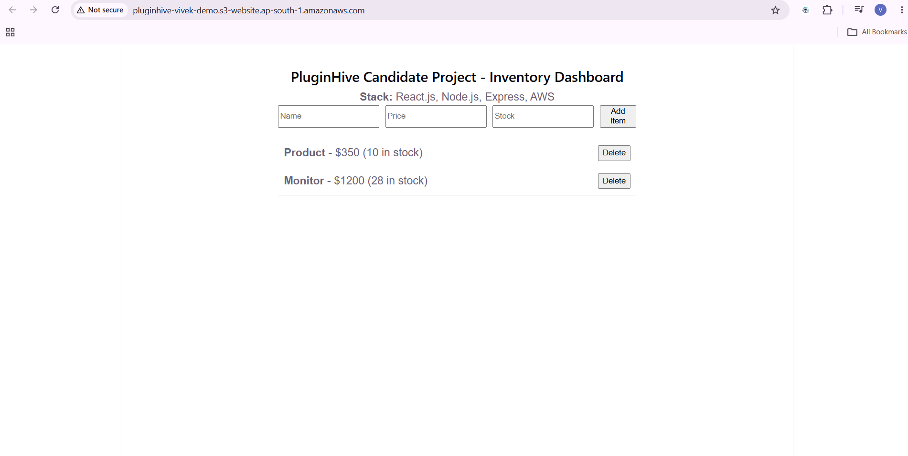

# PluginHive Candidate Project - Inventory Dashboard

A full-stack web application for inventory management built with **React.js**, **Node.js (Express)**, and hosted live using **AWS S3 Static Website Hosting**.



## 🚀 Live Demo & Repository Links
* **Live AWS Hosting:** [AWS S3 Live Demo](http://pluginhive-vivek-demo.s3-website.ap-south-1.amazonaws.com/)
* **GitHub Repository:** [vivek65666/pluginhive-demo](https://github.com/vivek65666/pluginhive-demo)

---

## 🛠️ Architecture & Tech Stack

* **Frontend:** React.js (Vite), JavaScript (ES6+), HTML5/CSS3
* **Backend:** Node.js, Express.js
* **Cloud & Infrastructure:** AWS S3 (Static Website Hosting), Docker, Docker Compose
* **Data Services:** Redis (Caching), OpenSearch (Query/Search Engine)

---

## 📌 Project Overview & Implementation Details

1. **React.js Frontend:**
   * Single-page responsive interface providing real-time UI updates for inventory item creation and deletion.
   * Built with Vite for rapid bundling and optimized production builds.
   * Includes optimistic state management and offline fallback handling for static bucket environments.

2. **Node.js & Express API Backend:**
   * RESTful endpoints handling core business logic, search capabilities, and inventory CRUD operations.
   * Containerized via `docker-compose.yml` along with Redis and OpenSearch services for easy deployment onto AWS compute environments (EC2/ECS).

3. **AWS S3 Deployment:**
   * Configured bucket public access policies and S3 Static Website Hosting routing.
   * Uploaded production assets directly to serve client traffic live on AWS infrastructure.

---

## 💻 Local Development Setup

### Prerequisites
* **Node.js** (v18+)
* **Docker Desktop** (for containerized backend services)

### 1. Clone the Repository
```bash
git clone [https://github.com/vivek65666/pluginhive-demo.git](https://github.com/vivek65666/pluginhive-demo.git)
cd pluginhive-demo
